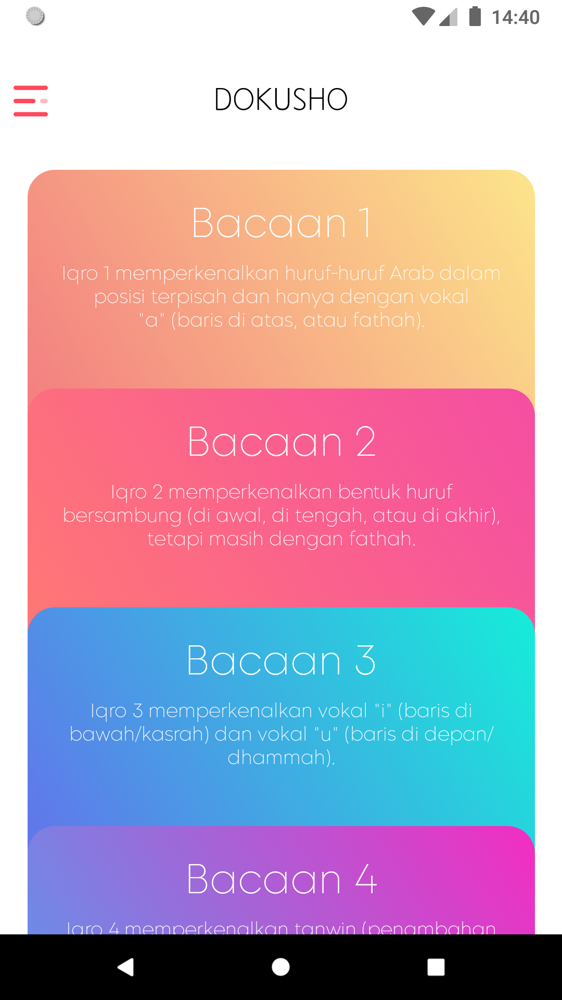
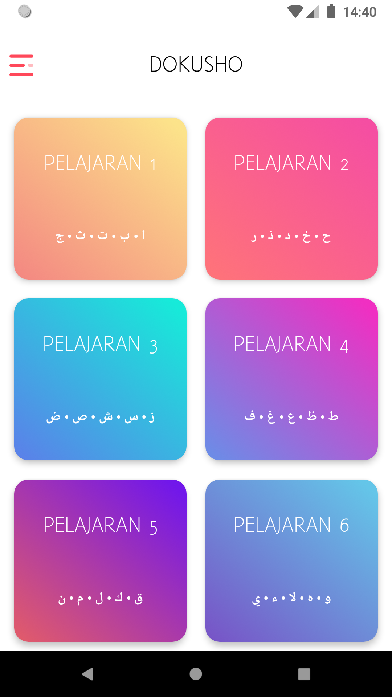
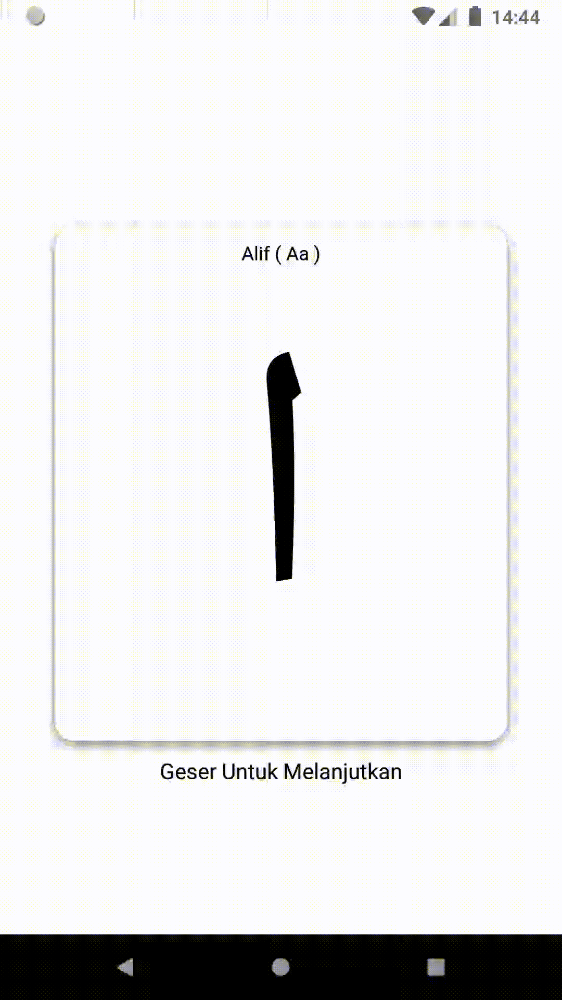
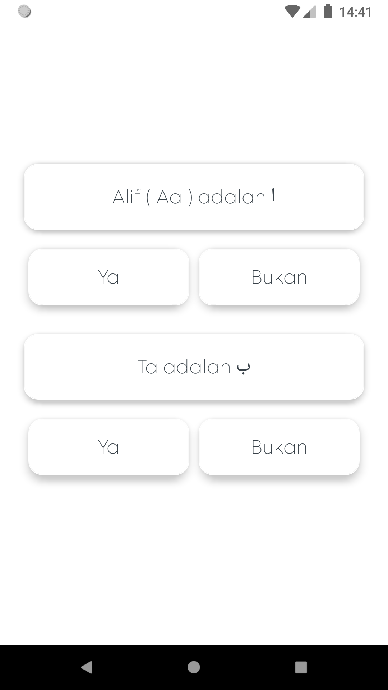
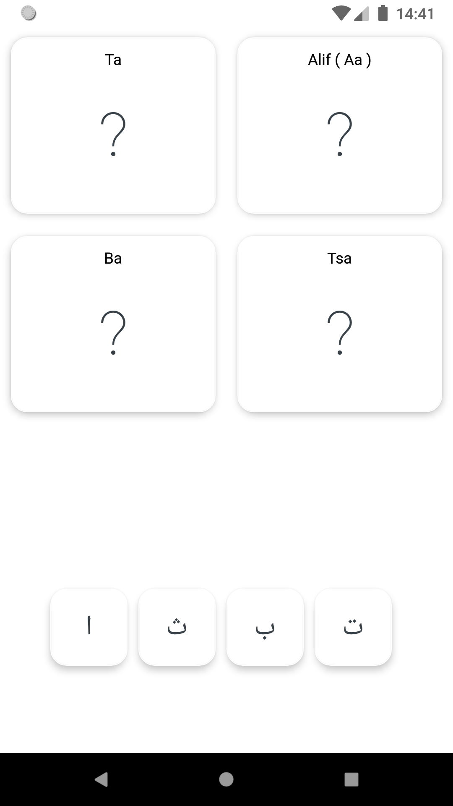
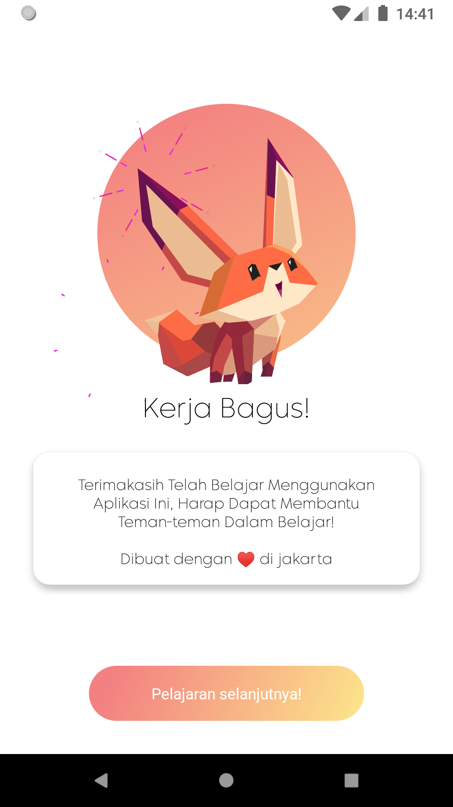

<h2>Dokusho</h2>

Aplikasi pembelajaran untuk menghapal huruf hijaiyah dengan menggunakan metode quiz.

Aplikasi ini terinspirasi dari metode pembelajaran *iqro*. yang akan terdiri dari *iqro* 1 hingga *iqro* 6 namun saat ini baru hanya <b><i>iqro</i> 1</b> saja dan juga
dalam project ini masih terdapat banyak masalah diantaranya :

<ul>
  <li>random question</li>
  <ul>
    <li>BasicQuest = terkadang pilihan tidak sesuai</li>
    <li>YesorNo = terkadang pertanyaan & pilihan berubah setelah dipilih</li>
    <li>MainApalau = data belum dinamis</li>
   </ul>
  <li>ui belum responsive</li>
</ul>

untuk update kedepan akan diharapkan dapat membetulkan semua masalah di atas dan akan menambahkan materi yang sesuai sehingga aplikasi ini dapat berguna. dan ini adalah beberapa <i>screenshot</i> pada aplikasi ini

   

    
    
    
    
    
    
  

